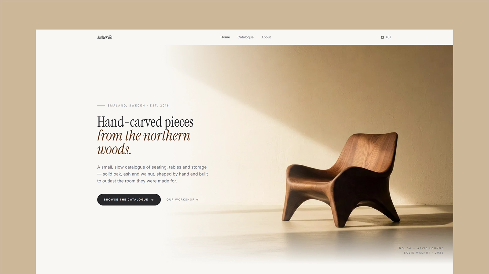

# MOART - Tema de esculturas en marmolina

[](https://moart.example/)


Vista previa: [https://moart.example/](https://moart.example/)

MOART es un tema editorial y sereno de Astro para un pequeño estudio taller de esculturas en marmolina. Totalmente estático, con pequeñas mejoras en JavaScript para los filtros del catálogo, la galería de productos y la colección local.

## Features

- Polished homepage with hero, featured products, material story, newsletter form, and footer
- Catalogue page with client-side category and material filters, and price sorting
- Static product detail pages generated from Markdown content with Zod-validated frontmatter
- Product image gallery with thumbnail navigation
- LocalStorage cart with quantity controls and a multi-step checkout preview
- About page with workshop story, principles, image-led sections, and contact CTA
- Astro-optimized images served in WebP with responsive widths
- Self-hosted WOFF2 fonts (Inter, Instrument Serif) — no external requests
- Full SEO: canonical URLs, Open Graph, Twitter cards, Product and Organization JSON-LD, sitemap, dynamic `robots.txt`
- Accessible: skip-to-content link, ARIA labels, focus-managed mobile menu, semantic HTML
- Strict TypeScript throughout

## Tech Stack

- Astro 7
- Tailwind CSS 4
- TypeScript (strict)
- Static output

## Getting Started

```bash
npm install
npm run dev
```

Build for production:

```bash
npm run build
```

Preview the production build locally:

```bash
npm run preview
```

## Theme Setup

Update the production URL before publishing:

```bash
SITE=https://your-domain.com npm run build
```

The configured `site` value is used for canonical URLs, sitemap generation, and `robots.txt`. The default preview site is `https://moart.example/`.

Main content files:

- `src/content/products/*.md` — entradas del catálogo de esculturas, frontmatter, imágenes y descripciones
- `src/content.config.ts` — esquema de la colección de contenido de productos
- `src/data/products.ts` — utilidades que leen y ordenan el contenido de productos
- `src/layouts/BaseLayout.astro` — metadatos compartidos, estructura global, slots de cabecera/pie y ayudante de colección
- `src/components/SiteHeader.astro` — navegación y badge de la colección
- `src/components/SiteFooter.astro` — enlaces del pie y texto del estudio
- `src/styles.css` — tokens de diseño, configuración de Tailwind y fuentes locales

## Añadir esculturas

Añade un archivo Markdown por escultura en `src/content/products/`. El nombre del archivo se convierte en el slug de la URL, así que `escultura-aurora.md` se convierte en `/products/escultura-aurora`.

```md
---
name: Aurora
collection: Colección I — Figuras
category: Figuras
material: Marmolina
price: 840
shortDescription: Figura de marmolina
dimensions: 32 × 28 × 54 cm
finish: Mate natural
leadTime: 4–6 semanas
images:
  - /assets/catalogo/catalogo-01.jpg
  - /assets/catalogo/catalogo-02.jpg
order: 2
---

Escultura figurativa en marmolina, Aurora interpreta el gesto de un cuerpo en equilibrio. Cada pieza se moldea y pule a mano en nuestro taller.
```

Las imágenes de producto viven en `src/assets/catalogo/` y se referencian en el frontmatter con su ruta pública `/assets/catalogo/...`. Durante el build, `src/data/product-images.ts` las resuelve a imágenes optimizadas por Astro. Las categorías y materiales se derivan automáticamente de los archivos de producto y aparecen como filtros del catálogo.

## Content Management (Pages CMS)

El tema incluye `.pages.yml` en la raíz para gestionar el catálogo desde [Pages CMS](https://pagescms.org) sin tocar Markdown a mano: puedes crear y editar esculturas, y subir imágenes desde el navegador.

1. Sube el repositorio a GitHub. `.pages.yml` debe estar en la rama por defecto para que Pages CMS lo detecte.
2. Entra en <https://pagescms.org>, autoriza con GitHub y selecciona el repositorio.
3. En la pestaña **Products**, crea, edita o borra esculturas. Cada producto se guarda como un `.md` nuevo en `src/content/products/` y el nombre del archivo se convierte en el slug de la URL.
4. En el campo *images*, usa **Añadir imagen** para subir desde el navegador. Los archivos se guardan en `src/assets/catalogo/` y la ruta `/assets/catalogo/...` se escribe automáticamente en el frontmatter; Astro las optimiza en build.
5. Publica el commit con Git y despliega como cualquier otra versión del sitio.

Para desarrollar el CMS en local, sigue la [guía de instalación de Pages CMS](https://pagescms.org/docs/).

## Pages

- `/` — Homepage
- `/catalog` — Full catalogue with filters
- `/products/[slug]` — Product detail
- `/about` — Studio story
- `/cart` — Cart and checkout preview

## Images and Fonts

Theme images live in `src/assets` and render through Astro's image pipeline. Local fonts live in `src/assets/fonts`; only the weights and styles used by the theme are included.

Use `public/` only for files that should be served as-is.

## SEO

### Configuración central

Todo el SEO se apoya en `src/data/site.ts`: nombre, dominio, contacto, redes, ubicación, moneda y descripción por defecto. Cámbialo una vez y se actualiza en todas las páginas, en el JSON-LD, en `robots.txt` y en `llms.txt`.

El origen canónico es `site` en `astro.config.mjs`, que lee la variable de entorno `SITE`. Sin ella, el sitio asume `https://moarthouse.com/`.

### Por página

`src/components/Seo.astro` se inyecta desde `BaseLayout.astro`. Cada página pasa su propio `title` y `description`:

```astro
<BaseLayout
  title="Arcangel San Miguel Premium en marmolina"
  description="Arcangel en marmolina blanca, moldeado y pulido a mano en Medellín."
  image={product.images[0]}
  imageAlt="Arcangel San Miguel Premium visto de frente"
  ogType="product"
  schema={schema}
  noindex={false}
>
```

- El título se normaliza a `Página — MOART` y se recorta la descripción a 160 caracteres sin cortar palabras.
- La imagen OG se optimiza a 1200×630 y se usan sus dimensiones reales en `og:image:width/height`.
- Sin `image` se cae a `/og-default.jpg`.
- `noindex` se aplica en `/cart` y `/404`.

### Datos estructurados

Los nodos JSON-LD se agrupan en un único `@graph` por página y se referencian por `@id` (`/#organization`, `/#website`). Los builders viven en `src/utils/seo.ts`:

| Builder | Dónde se usa |
| --- | --- |
| `organizationSchema()` | Todas las páginas — `LocalBusiness` con dirección, contacto y `sameAs` |
| `websiteSchema()` | Home — `WebSite` con `publisher` |
| `breadcrumbSchema()` | Todas menos la home — `BreadcrumbList` |
| `productSchema()` | `/products/[slug]` — `Product` con `Offer`, `shippingDetails` y `hasMerchantReturnPolicy` |
| `itemListSchema()` | Home y catálogo — `ItemList` |

No añadas schema que no se corresponda con contenido visible en la misma página.

### Sitemap

El sitemap se genera con un endpoint propio, `src/pages/sitemap.xml.ts`, que escribe un único `dist/sitemap.xml`. No se usa `@astrojs/sitemap` porque esa integración siempre produce `sitemap-index.xml` + `sitemap-N.xml` y nunca un `sitemap.xml` plano. Con menos de 50.000 URLs un solo archivo es lo correcto y más simple para los buscadores.

La lógica vive en `src/data/sitemap.ts`:

- `STATIC_PAGES` — rutas estáticas con su `priority` y `changefreq`. **Si añades una página nueva, añádela aquí.**
- `SITEMAP_EXCLUDED` — rutas que nunca se incluyen (`/cart`, `/404`, `/robots.txt`, `/sitemap.xml`).
- Los productos se derivan de la colección de contenido y la paginación del catálogo se calcula con `CATALOG_PAGE_SIZE`, así que no hay listas de URLs que mantener a mano.
- `lastmod` por producto sale del mtime de su markdown.

Señales actuales: home `1.0/weekly`, catálogo `0.9/weekly`, paginación `0.4/weekly`, productos `0.8/monthly`, about `0.6/yearly`.

### robots.txt

`src/pages/robots.txt.ts` emite bloques explícitos para `GPTBot`, `OAI-SearchBot`, `ChatGPT-User`, `ClaudeBot`, `PerplexityBot`, `Google-Extended`, `Applebot`, `CCBot`, `Bingbot` y otros. Si en algún momento quieres bloquear los bots de IA, cambia el `allowAi` a `false` en cada llamada: los bloques pasarán a `Disallow: /`.

### Archivos para LLMs

- `/llms.txt` — resumen del negocio, páginas principales, catálogo agrupado por categoría y notas operativas.
- `/llms-full.txt` — texto íntegro: sobre el estudio, proceso, ficha completa de cada pieza y preguntas frecuentes.

Ambos se generan desde `src/data/llms.ts`, que lee el contenido real del catálogo, así que se mantienen sincronizados con los productos. La narrativa (políticas, plazos, material) está en `BUSINESS_FACTS` y en las secciones de texto de ese archivo: actualízalas si cambian las condiciones del negocio. No los enlaces desde el pie de página: los LLMs los encuentran por la URL convencional y por el `Sitemap:` de `robots.txt`.

### Verificación

```bash
npx astro check   # tipos y warnings
npm run build     # genera dist/ con robots.txt, sitemaps y llms.txt
```

Revisa en Search Console el sitemap y valida el JSON-LD de una página de producto antes de publicar.

## Deployment

The theme builds to static files in `dist/` and deploys to any static host. Set `SITE` to the production origin during deployment so SEO URLs are correct. `SITE=https://moarthouse.com npm run build`

## License

This project is licensed under the [MIT License](LICENSE).

## Notes

- Replace the demo product copy, prices, and images with your own catalogue before publishing.
- The newsletter and checkout flows are design previews; connect them to your preferred backend or form provider if needed.
- `LocalBusiness` omits `streetAddress` on purpose. Add it in `src/data/site.ts` once you have a public shop address; never invent one.
- The address, phone and email in `src/data/site.ts` appear in the JSON-LD and in `llms.txt`. Keep them in sync with the real business data.
